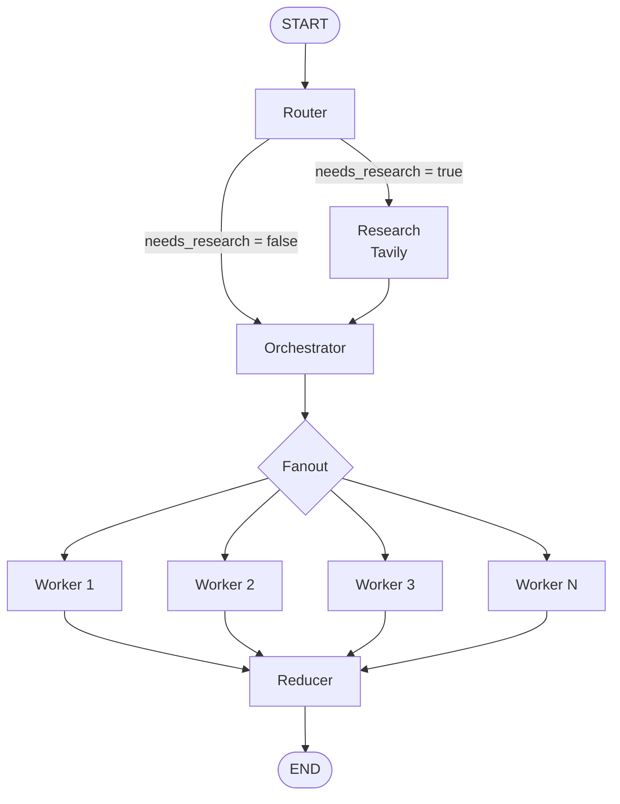

# 🤖 Blog Writing Agent

A research-aware **Agentic AI blog writing system built with LangGraph**.

The workflow decides whether a topic needs web research, optionally researches it with **Tavily**, creates a structured writing plan, generates sections through parallel workers, and finally combines the sections into a Markdown blog.

The notebook for this project is:

`4_bwa_research_fine_tuned.ipynb`

---

## ✨ What This Project Does

Given a topic such as:

```text
Write a blog on Transformer Architecture
```

the agent follows a multi-step workflow:

1. **Router** decides whether the topic requires web research.
2. **Research** searches the web with Tavily when required.
3. **Orchestrator** creates a structured blog plan.
4. **Fanout** sends each planned section to a separate worker.
5. **Workers** write individual sections in Markdown.
6. **Reducer** orders and combines the sections.
7. The final blog is saved as a `.md` file.

This separates planning, research, writing, and aggregation instead of asking a single LLM call to generate the complete blog.

---

## 🏗️ Architecture



### Core LangGraph flow

```text
START
  ↓
Router
  ├── Research → Orchestrator
  └────────────→ Orchestrator
                       ↓
                    Fanout
                       ↓
                Parallel Workers
                       ↓
                    Reducer
                       ↓
                      END
```

---

## 🧠 Agent Workflow

### 1. Router

The router decides how much research the topic needs.

It supports three modes:

| Mode | Research | Intended use |
|---|---:|---|
| `closed_book` | No | Evergreen concepts and fundamentals |
| `hybrid` | Yes | Mostly evergreen topics with current examples/tools/models |
| `open_book` | Yes | Volatile topics such as weekly roundups, latest updates, rankings, pricing, policies, etc. |

The router also generates targeted search queries when research is required.

The research window is automatically selected:

- `closed_book` → `3650` days
- `hybrid` → `45` days
- `open_book` → `7` days

The notebook also accepts an explicit **as-of date** so that research can be evaluated relative to a specific date.

---

### 2. Research with Tavily

When research is required, the agent uses **Tavily** to search the web.

The research node:

- Uses up to 10 generated queries.
- Fetches up to 6 results per query.
- Normalizes search results.
- Keeps title, URL, snippet, publication date, and source.
- Deduplicates evidence by URL.
- Uses the LLM to convert raw search results into structured `EvidenceItem` objects.
- Applies a hard recency filter for `open_book` mode.

For `open_book`, sources without a parseable publication date are removed by the final recency filter.

---

### 3. Orchestrator

The orchestrator creates a structured `Plan`.

The plan contains:

- Blog title
- Audience
- Tone
- Blog type
- Constraints
- Individual writing tasks

The orchestrator is instructed to create **5–9 sections**.

Each section contains:

- A goal
- 3–6 concrete bullets
- Target word count
- Optional tags
- Whether research is required
- Whether citations are required
- Whether code is required

The planner also aims to include practical areas such as:

- Minimal code examples
- Edge cases
- Failure modes
- Performance and cost
- Security and privacy
- Debugging and observability

depending on the topic.

---

## 🔀 Parallel Worker Architecture

After planning, the `fanout()` function uses LangGraph's `Send` mechanism to create a worker execution for every task.

Conceptually:

```text
Plan
 ├── Task 1 → Worker
 ├── Task 2 → Worker
 ├── Task 3 → Worker
 ├── Task 4 → Worker
 └── Task N → Worker
```

Each worker receives:

- The topic
- Its assigned task
- The complete plan
- Research evidence
- Research mode
- As-of date
- Recency window

Each worker writes **one section only**.

This keeps individual LLM calls focused and makes the workflow easier to control.

---

## ✍️ Worker

The worker is instructed to:

- Follow the section goal.
- Cover all provided bullets in order.
- Stay within approximately ±15% of the target word count.
- Output Markdown only.
- Start with a `##` heading.
- Avoid unnecessary fluff.
- Use code fences when code is required.
- Use evidence URLs for claims that require citations.

For `open_book` mode, specific claims about events, companies, models, funding, policies, etc. must be supported by URLs supplied in the evidence pack.

---

## 🧩 Reducer

The reducer collects all worker outputs and sorts them using their task IDs.

```python
ordered_sections = [
    md for _, md in sorted(
        state["sections"],
        key=lambda x: x[0]
    )
]
```

It then combines the sections and adds the generated blog title:

```text
# Blog Title

## Section 1
...

## Section 2
...

## Section 3
...
```

The final Markdown is saved using the generated blog title:

```text
<blog_title>.md
```

---

# 🧱 Data Models

The notebook uses **Pydantic** models for structured LLM outputs.

## `Task`

Represents one section of the blog.

```python
class Task(BaseModel):
    id: int
    title: str
    goal: str
    bullets: List[str]
    target_words: int

    tags: List[str] = []
    requires_research: bool = False
    requires_citations: bool = False
    requires_code: bool = False
```

## `Plan`

Represents the complete blog structure.

```python
class Plan(BaseModel):
    blog_title: str
    audience: str
    tone: str
    blog_kind: Literal[
        "explainer",
        "tutorial",
        "news_roundup",
        "comparison",
        "system_design"
    ]
    constraints: List[str] = []
    tasks: List[Task]
```

## `EvidenceItem`

Represents one research source.

```python
class EvidenceItem(BaseModel):
    title: str
    url: str
    published_at: Optional[str] = None
    snippet: Optional[str] = None
    source: Optional[str] = None
```

## `RouterDecision`

Represents the router's decision.

```python
class RouterDecision(BaseModel):
    needs_research: bool
    mode: Literal[
        "closed_book",
        "hybrid",
        "open_book"
    ]
    reason: str
    queries: List[str] = []
    max_results_per_query: int = 5
```

## `EvidencePack`

Represents the structured research collection.

```python
class EvidencePack(BaseModel):
    evidence: List[EvidenceItem] = []
```

---

# 🗃️ LangGraph State

The graph uses a `TypedDict` called `State`.

```python
class State(TypedDict):
    topic: str

    mode: str
    needs_research: bool
    queries: List[str]
    evidence: List[EvidenceItem]
    plan: Optional[Plan]

    as_of: str
    recency_days: int

    sections: Annotated[
        List[tuple[int, str]],
        operator.add
    ]

    final: str
```

The `sections` field uses `operator.add` so worker outputs can be accumulated as the parallel workers finish.

---

# 🤖 LLM

The notebook uses:

```python
from langchain_mistralai import ChatMistralAI

llm = ChatMistralAI(
    model="codestral-2508",
    api_key=os.getenv("MISTRAL_API_KEY"),
    temperature=0
)
```

The same LLM is used for:

- Routing
- Research synthesis
- Blog planning
- Section writing

---

# 🔎 Research Stack

The research component uses:

```python
from langchain_tavily import TavilySearch
```

Tavily provides the web search results, which are then normalized into the project's `EvidenceItem` structure.

---

# 🛠️ Tech Stack

- **Python**
- **LangGraph**
- **LangChain Core**
- **LangChain Mistral**
- **Mistral AI**
- **Tavily**
- **Pydantic**
- **python-dotenv**
- **Markdown**

---

# ⚙️ Setup

## 1. Clone the project

```bash
git clone <your-repository-url>
cd <your-project-folder>
```

## 2. Create a virtual environment

Windows:

```bash
python -m venv venv
venv\Scripts\activate
```

macOS/Linux:

```bash
python3 -m venv venv
source venv/bin/activate
```

## 3. Install the packages used by the notebook

```bash
pip install langgraph langchain-core langchain-mistralai langchain-tavily langchain-community pydantic python-dotenv
```

## 4. Configure API keys

Create a `.env` file:

```env
MISTRAL_API_KEY=your_mistral_api_key
TAVILY_API_KEY=your_tavily_api_key
```

The notebook reads the Mistral key from the environment.

The Tavily tool also requires Tavily authentication configured for your environment.

> Keep API keys private and never commit `.env` to Git.

---

# ▶️ Running the Notebook

Open the notebook:

```bash
jupyter notebook 4_bwa_research_fine_tuned.ipynb
```

Then run the cells in order.

The notebook compiles the graph:

```python
app = g.compile()
```

A sample execution is included:

```python
run("Write a blog on Transformer Architecture")
```

You can also provide an explicit date:

```python
run(
    "Write a blog on Transformer Architecture",
    as_of="2026-09-22"
)
```

---

# 📄 Output

The `run()` function prints information about the generated workflow, including:

```text
TOPIC
AS_OF
RECENCY_DAYS
MODE
BLOG_KIND
NEEDS_RESEARCH
QUERIES
EVIDENCE_COUNT
EVIDENCE_SAMPLE
TASKS
SAVED_MD_CHARS
```

The reducer saves the final blog as:

```text
<generated-blog-title>.md
```

---

# 🔐 Citation & Grounding Behavior

The project distinguishes between evergreen knowledge and claims that require fresh research.

### `closed_book`

The blog can be written from the model's knowledge without web evidence.

### `hybrid`

Fresh information can be incorporated from the retrieved evidence.

Sections marked with:

```text
requires_research=True
requires_citations=True
```

are instructed to use the supplied evidence URLs for outside-world claims.

### `open_book`

This mode is designed for volatile topics.

The worker is instructed not to introduce specific current claims unless they are supported by the supplied evidence.

Citations are generated as Markdown links:

```markdown
([Source](URL))
```

Only URLs supplied through the evidence passed to the worker should be used.

---

# 📌 Example Workflow

For:

```text
Write a blog on Transformer Architecture
```

the system can conceptually execute:

```text
User Topic
    ↓
Router
    ↓
Does it need current information?
    ↓
No → Orchestrator
    ↓
Create 5–9 section plan
    ↓
Fanout
    ↓
┌────────────┬────────────┬────────────┐
│ Worker 1   │ Worker 2   │ Worker 3   │ ...
└────────────┴────────────┴────────────┘
    ↓
Reducer
    ↓
Final Markdown Blog
```

For a current or volatile topic:

```text
User Topic
    ↓
Router
    ↓
Research required
    ↓
Tavily Search
    ↓
Evidence Extraction
    ↓
Recency Filtering
    ↓
Orchestrator
    ↓
Parallel Workers
    ↓
Reducer
    ↓
Final Markdown Blog
```

---

# 🎯 Why This Architecture?

The project separates responsibilities across multiple graph nodes instead of using one large generation prompt.

### Router
Determines whether external research is necessary.

### Research
Collects and structures external evidence.

### Orchestrator
Converts the topic into an actionable writing plan.

### Workers
Focus on individual sections.

### Reducer
Restores deterministic section order and creates the final document.

This makes the workflow easier to inspect, control, and extend.

---

# 🚧 Current Scope

The notebook currently focuses on:

- Technical blog planning
- Research-aware generation
- Tavily web search
- Structured outputs
- Recency-aware research
- Parallel section generation
- Markdown generation
- Local Markdown file saving

The notebook itself does not define a production deployment layer, database persistence, authentication system, or API service.

---

# 🔮 Possible Extensions

Potential future improvements include:

- Streaming graph execution
- Persistent blog history
- Human-in-the-loop review
- Source quality scoring
- More advanced citation validation
- Automatic image generation
- SEO metadata generation
- Keyword research
- Internal linking
- Blog quality evaluation
- Plagiarism/similarity checks
- Retry and error-handling policies
- Cost and token tracking
- Web UI using Streamlit

---

# 📁 Project File

```text
4_bwa_research_fine_tuned.ipynb
```

The notebook contains the complete implementation of the workflow described above.

---

# 👨‍💻 Project

**Blog Writing Agent**

Built with:

```text
LangGraph + Mistral AI + Tavily + Pydantic
```

The main goal is to explore how **Agentic AI workflows can combine routing, web research, structured planning, parallel execution, and reduction into a single automated content-generation pipeline.**
